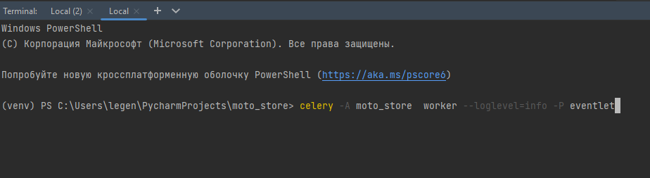
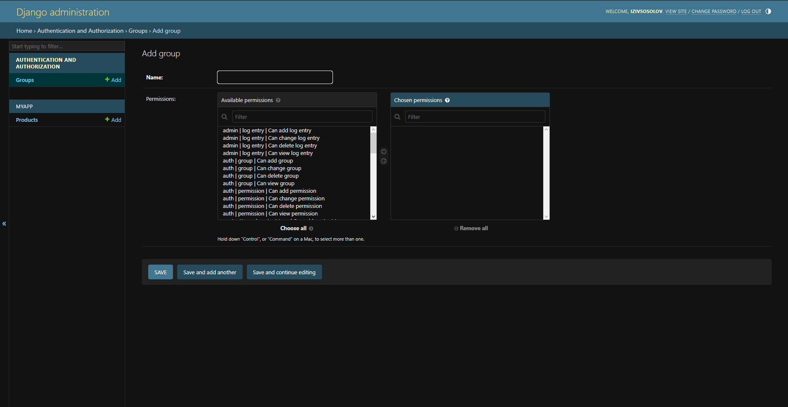
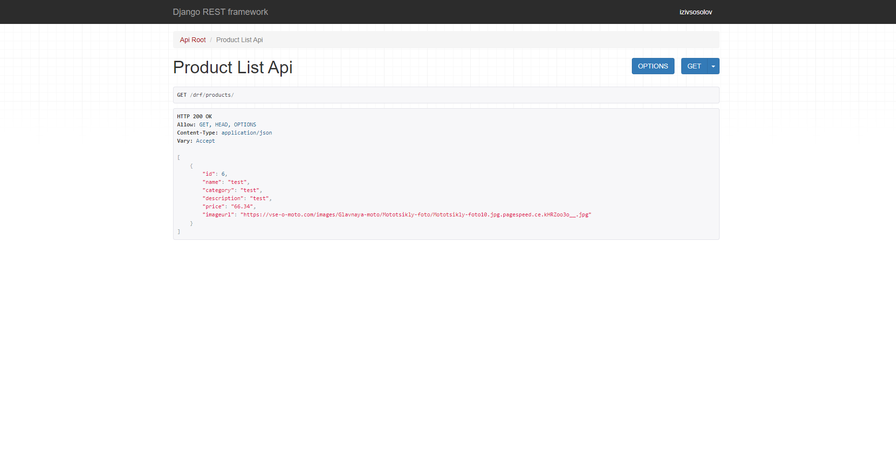
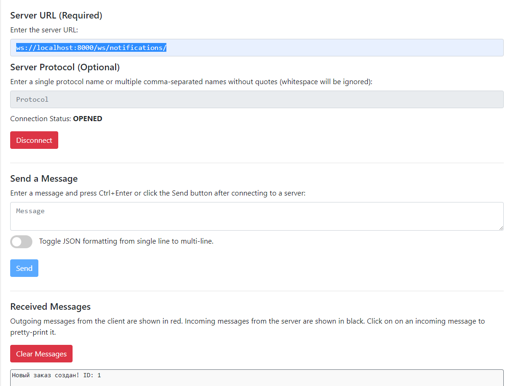
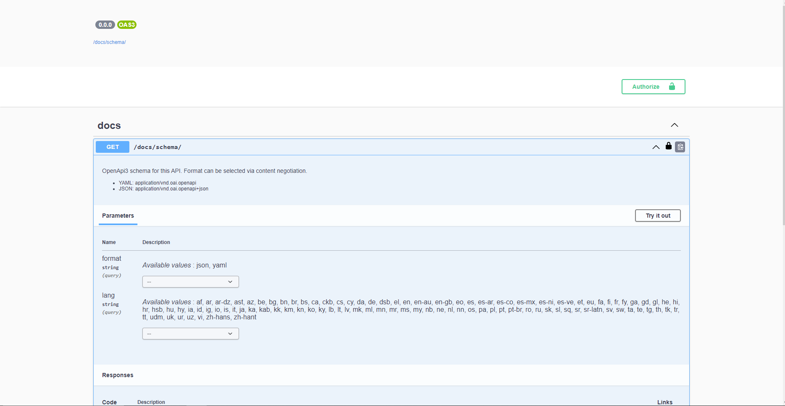

# Мото Магазин
Добро пожаловать в мотомагазин 'Мото-Мото'! Это приложение позволяет оформлять заказы, выполнять задачи по расписанию, использовать стороннее API, использовать вебсокеты. Также включает в себя стандартный функционал (регистрация, авторизация и другие CRUD операции)
## Содержание
- [Устанвока и настройка](#Установка)
- [Использование](#Использование)
# Установкаа
- Склонируйте репозиторий (если еще не сделали этого)
- Откройте терминал в папке с проектом, либо используйте IDE
- Настройте виртуальное окружение python -m venv venv  (опционально)
- Установите зависимости, выполнив команду pip install -r requirements.txt
- Введите команду pip install --upgrade eventlet
- Создайте базу данных и настройте подключение к базе данных в файле settings.py
- Выполните миграции, используя команду python manage.py migrate
- Создайте администраторский аккаунт с помощью команды python manage.py createsuperuser (понадобится для администрирования)
- Запустите Celery, используя команды:  
- celery -A moto_store  worker --loglevel=info -P eventlet  
- celery -A moto_store beat --loglevel=debug 
- (запустить их нужно в 2 отдельных терминалах, можно открыть второй терминал комбинацией клавиш CTRL+SHIFT+T)
- По умолчанию, задача уменьшает цену на 5% всех товаров в 17:00 по МСК и возвращает обратно в 17:30

# Использование
## Запуск:
- Введите в терминале в корневой папке проекта команду python .\manage.py runserver 
- Зайдите по адресу http://127.0.0.1:8000/
## Панель администратора:
- Перейдите по адресу http://127.0.0.1:8000/admin или нажмите на специальную ссылку на главной странице
- На странице ввиде логин и пароль ранее введнного суперюзера
- На данной странице вы можете создать новые группы юзеров (роли), которым можете раздать определенные права

## API:
- Перейдите по адресу http://127.0.0.1:8000/drf/api/ или нажмите на специальную ссылку на главной странице
- Выберите нужную функцию API (нажать на ссылку)
- На выбранной странице будут отображаться все пользователи или товары, созданные в БД

## WS:
Для использования Веб-сокетов необходимо подключиться по адресу ws://localhost:8000/ws/notifications/ с помощью стороннего софта (например, BROWSER WEBSOCKET CLIENT)
При оформлении нового заказа всем, кто прослушивает данный вебсокет будет отправлено сообщение с ID нового заказа

## Swagger:
Для просмотра документации в Swagger перейдите по адресу http://127.0.0.1:8000/docs/swagger/

Вклад
Вы можете вносить свой вклад в развитие Мото Магазина, создавая запросы на извлечение данных, сообщая об ошибках и предлагая новые функции. Пожалуйста, откройте новый запрос на извлечение данных (issue) в этом репозитории.
